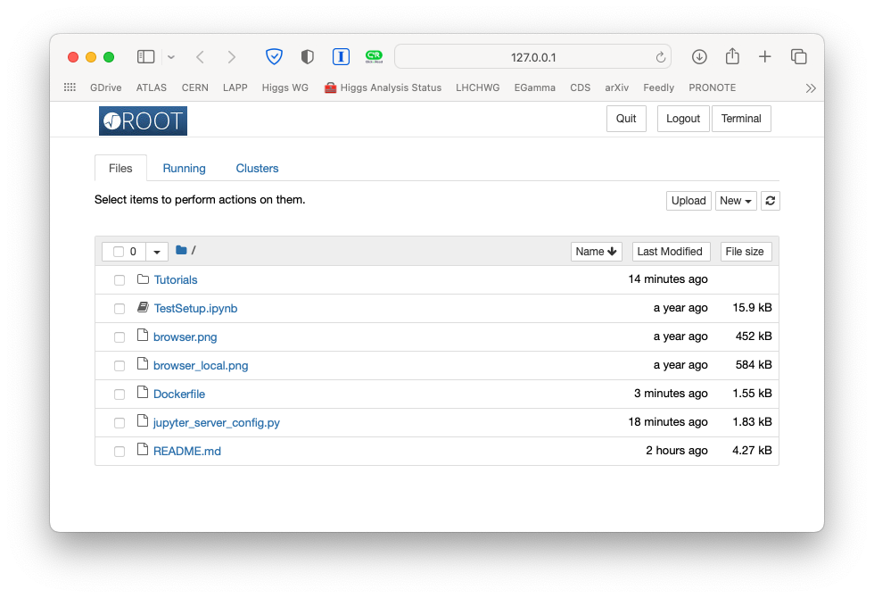
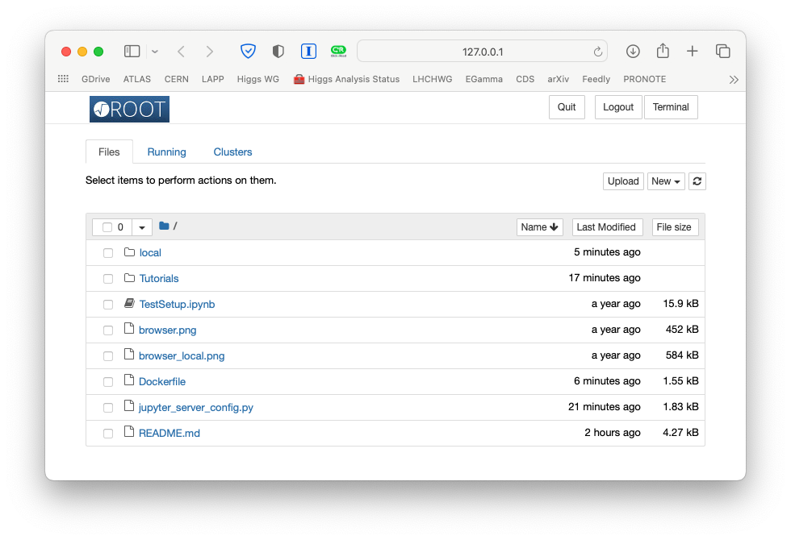

# ESIPAP  Experimental Particle Physics Tutorials

This repository containes the [Python notebooks](Tutorials) to run data analysis exercises we perform in one of the ESIPAP EPP tutorials.

We will use [ROOT](https://root.cern) and [Python](https://www.python.org) with [Jupyter](https://jupyter.org) notebooks. You have several options to run these notebooks:

- You already have a local setup version of Python3 and ROOT (with Python support enabled) installed on your computer: clone or download the repository, and run the notebooks locally.

- You have a CERN account, and you know how to use [SWAN](http://swan.cern.ch): clone the repository on your CERNBox area to access and run the notebooks.

- You would like to run Python and ROOT on your computer, but you don't have them installed and you are not sure about how to properly do it. In this case, the safest option is to use [Docker](https://www.docker.com), and to use the container that already have the proper setup. Here's is a quick list of instructions:

   * Install [Docker Desktop](https://www.docker.com/products/docker-desktop) for you OS;

   * Once done, make sure you can run the `docker` command from a terminal;

   * From the command line, run the command:  
     \
     `docker run --rm -p 8888:8888 --name esipap-epp-tutorials marcodelmastro/esipap-epp-tutorials:latest`
	 \
     This will start the `esipap-epp-tutorials` container.
	 You should see on the screen a series of messages, including one with a `http` address similar to this (**the token string will be different!**):  
	 \
     `http://127.0.0.1:8888/?token=5666c2fc6015b0e0310382076f31ad9df7f2afc2694090ff`

   * Copy and paste the address in your browser, and you should land on a page like this one:  
     

   * Note that if you use the procedure described above, **every change you make to the notebook will be lost when you stop the container!**. 
     This is because docker will serve you the notebook from the container, and you don't have the right to save them. 
	 In other to keep your changes run instead this command:  
	 \
     `docker run --rm -p 8888:8888 -v <location-of-the-repo>:/home/esipap/local --name esipap-epp-tutorials marcodelmastro/esipap-epp-tutorials:latest`  
	 \
	 where `<location-of-the-repo>` is the path to where you downloaded the `ESIPAP-EPP-Tutorials` repository. For instance, on a Unix machin is could be:  
	 \
	 `docker run --rm -p 8888:8888 -v /Users/Marco/ESIPAP-EPP-Tutorials:/home/esipap/local --name esipap-epp-tutorials marcodelmastro/esipap-epp-tutorials:latest`  
	 \
	 or, on a Windows machine, something like:  
	 \
	 `docker run --rm -p 8888:8888 -v C:\Users\Marco\ESIPAP-EPP-Tutorials:/home/esipap/local --name esipap-epp-tutorials marcodelmastro//esipap-epp-tutorials:latest`  
	 \
	 On a Unix machine you could also `cd` to the repository and use the `pwd` command like:  
	 \
	 `docker run --rm -p 8888:8888 -v $(pwd):/home/esipap/local --name esipap-epp-tutorials marcodelmastro/esipap-epp-tutorials:latest`  
	 \
	 In all these cases, when you open the notebook server windowd you should see something like:  
	 
	 **Note the `local` directory:** if you open it, you'll browse the repository on your disk (and not that in the container), and all changes you make to the notebooks, or any new notebook you create, will be saved on your disk.

- If none of the above works for you, you can launch a standalone [MyBinder](https://mybinder.org/v2/gh/marcodelmastro/ESIPAP-EPP-Tutorials/main) environment using the other button below: it will give you a working setup with Python and ROOT, that will allow you to run the notebooks from the browser. Note that in this case any change you make will be lost unless you manually copy your code from the browser window to somewhere else.

**Execute the [example notebook](TestSetup.ipynb) there to verify your setup!**

If you never used Python before, fear not! It's rather easy to get the grip of the basics. You can use the excellent [Crash Course](https://github.com/rpmuller/PythonCrashCourse) by [Rick Muller](http://www.cs.sandia.gov/~rmuller/) to get started.
